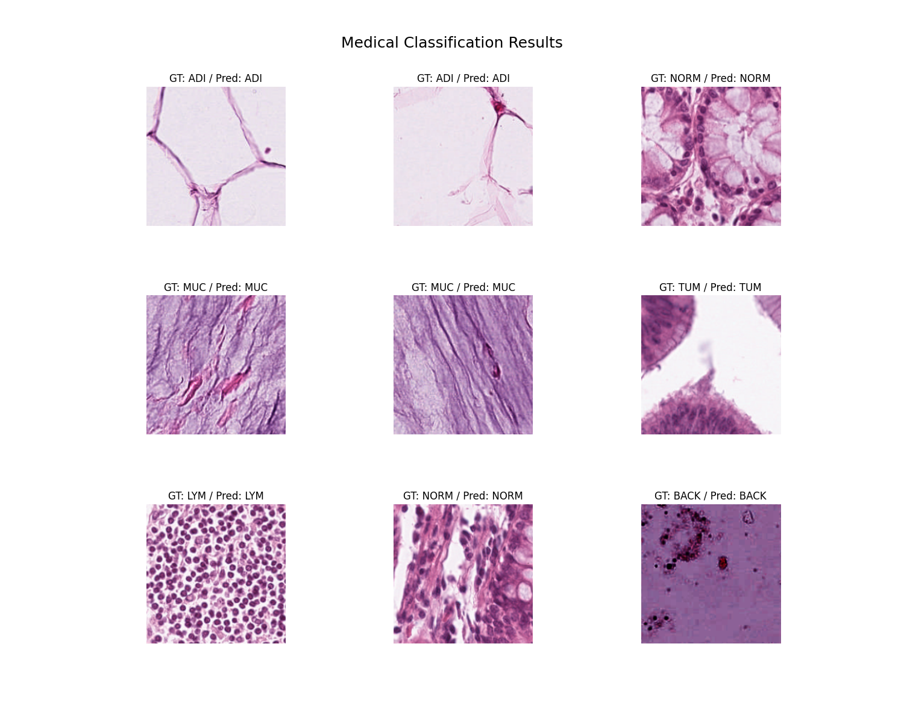

# medical-classification

연합학습 검증을 위한 의료 2D 데이터셋 기반 분류(classification) baseline 학습 및 검증 프로젝트

# Dataset

## NCT-CRC-HE-100K

100,000개의 train 셋과 7,180개의 test 셋으로 구성된 human colorectal cancer 및 healthy tissue 분류를 위한 데이터 셋

9개 클래스로 구성되어 있음 \
(Adipose (ADI), background (BACK), debris (DEB), lymphocytes (LYM), mucus (MUC), smooth muscle (MUS), normal colon mucosa (NORM), cancer-associated stroma (STR), colorectal adenocarcinoma epithelium (TUM))

데이터셋 디렉토리 구조는 다음과 같음

```
NCT-CRC-HE-100K
    NCT-CRC-HE-100K (train)
    ├── ADI
    │   ├── ADI-XXXXXXXX.tif
    │   ├── ...
    ├── BACK
    ├── DEB
    ├── ...
    ├── STR
    └── TUM
    CRC-VAL-HE-7K (test)
    ├── ADI
    │   ├── ADI-TCGA-XXXXXXXX.tif
    │   ├── ...
    ├── BACK
    ├── DEB
    ├── ...
    ├── STR
    └── TUM
```

아래 URL에서 두 셋의 .zip 파일을 다운로드할 수 있음
https://zenodo.org/records/1214456

다운로드 후 데이터셋의 root 경로를 train.py, eval.py 등의 "root_data_path" 변수에 적용해야 함

```python
# Linux
root_data_path = "/your-path/NCT-CRC-HE-100K"
# Windows
root_data_path = "C:\\your-path\\NCT-CRC-HE-100K"
```

# Model

ViT (Vision Transformer) 모델 사용 https://arxiv.org/abs/2010.11929

모델은 timm (https://github.com/huggingface/pytorch-image-models)을 사용하여 PyTorch 기반으로 구현됨

기본 모델은 'vit_base_patch16_224'로 구현되어 있으며, 필요에 따라 'vit_large_patch16_224' 모델도 사용할 수 있음

# Requirements

프로젝트 실험에 사용한 패키지 버전은 'requirements.txt'에 명시되어 있음 \

Python 3.9, Cuda 12.1을 사용함

핵심 패키지는 아래와 같음

- torch==2.3.1
- torchvision==0.18.1
- timm==1.0.7
- pillow
- matplotlib
- tqdm
- numpy

# Test and visualization

train.py로 학습된 모델은 Top-1 accuracy가 가장 높은 가중치만 .pt 파일로 ckpt 디렉토리에 저장됨 (ex. ckpt/best_top1_0.955.pt)

원하는 가중치의 경로를 eval.py의 인자로 주어 최종 성능을 다시 계산해볼 수 있음

```bash
python eval.py -c ckpt/best_top1_0.955.pt
```

모델이 예측한 클래스와 실제 클래스 (ground truth)를 이미지와 함께 비교하고 싶은 경우, tools/visualize.py를 사용할 수 있음 (-ns 인자로 원하는 샘플 수 지정 가능)

```bash
python tools/visualize.py -c ckpt/best_top1_0.955.pt -ns 9
```

이미지 저장 예시

